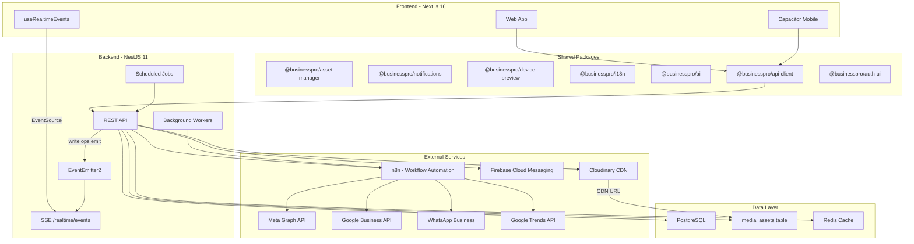
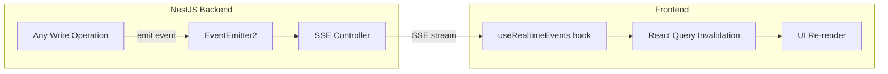
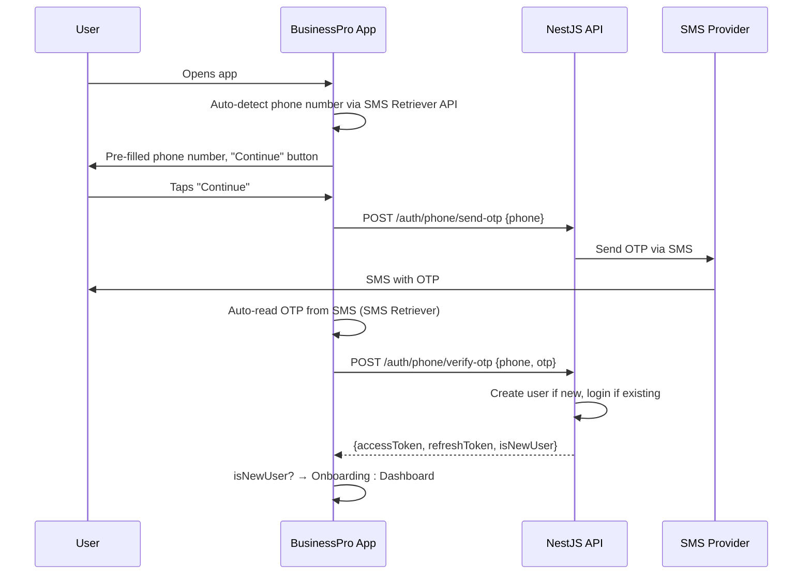
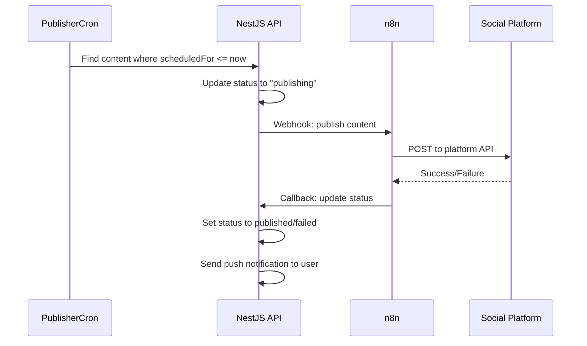
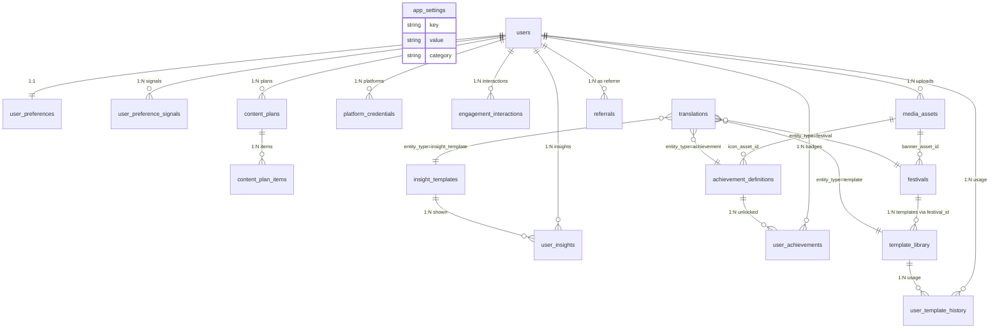

# BusinessPro -- Full Product Roadmap

## Architecture Overview




---

## Implementation Order (Critical)

All work follows this strict sequence per phase:

1. **Backend entities + modules + controllers + services** -- all API work first
2. **Run DB sync** (`DB_SYNCHRONIZE=true`) to auto-create new tables
3. **Start backend** and verify endpoints via Swagger
4. **Generate UI client** (`bun run generate:ui-client`) to produce React Query hooks
5. **Frontend pages + components** -- build UI using the generated hooks

This ensures the frontend always has typed, generated hooks to call and avoids any mismatched types or missing endpoints.

---

## Real-Time Data Layer (Cross-Cutting)

The entire app must feel instant -- no manual refresh, no stale data. Every state change is pushed to the client.

**Technology: Server-Sent Events (SSE)**

SSE is the best fit because:

- NestJS already has `@Sse()` decorator support (already used for AI streaming)
- Unidirectional server-to-client push is all that's needed for live updates
- No extra infrastructure (no Redis pub/sub required for MVP)
- Works with HTTP/2, lighter than WebSocket
- Better for mobile battery life
- Falls back gracefully on poor connections

**Architecture:**




**Backend: `RealtimeModule`**

- Uses `@nestjs/event-emitter` (EventEmitter2)
- New `RealtimeGateway` controller with SSE endpoint: `GET /realtime/events`
- Events are scoped per user (each user gets their own event stream filtered by `userId`)
- Event types:
  - `content.updated` -- content status changed (draft, scheduled, publishing, published, failed)
  - `content.published` -- a scheduled post went live
  - `engagement.new` -- new comment, review, or DM received
  - `engagement.responded` -- AI auto-responded or user responded
  - `plan.generated` -- bulk plan generation completed
  - `achievement.unlocked` -- user earned a new badge
  - `streak.updated` -- posting streak changed
  - `insight.new` -- a new AI insight is available
  - `notification.push` -- general notification event
  - `stats.updated` -- dashboard stats changed (engagement count, etc.)

**Backend implementation pattern:**

Every service that performs a write emits an event after the DB write:

```typescript
// In ContentService.publish()
await this.contentRepository.save(content);
this.eventEmitter.emit('content.published', { userId, contentId: content.id, platform: content.platform });
```

The `RealtimeGateway` listens to all events and streams them to the correct user's SSE connection.

**Frontend: `useRealtimeEvents` hook**

A shared React hook in `our-app/lib/realtime.ts`:

- Opens an `EventSource` connection to `GET /realtime/events`
- On receiving an event, calls `queryClient.invalidateQueries()` for the relevant query keys
- This triggers React Query to refetch the affected data, and the UI updates instantly
- Auto-reconnects on disconnect with exponential backoff
- Mounted once in the root dashboard layout

**What updates in real-time:**

- Dashboard stats (content count, engagement numbers, streak)
- Content list (status badges update live when publishing)
- Calendar (new scheduled items appear)
- Engagement feed (new comments/reviews stream in)
- Achievement toasts (pop up when unlocked)
- AI generation progress (already exists via SSE)

---

## Central Media Asset Registry (Cross-Cutting)

A single `media_assets` table that tracks EVERY file, image, icon, badge, video, audio, and AI-generated visual across the entire platform. All CDN URLs live here -- nothing hardcoded.

**New database table: `media_assets`**

- `id`, `uuid` (public-facing ID for URLs)
- `user_id` (nullable -- system assets like badge icons have no owner)
- `asset_type` enum: `image`, `video`, `audio`, `icon`, `badge`, `banner`, `document`
- `category` enum: `avatar`, `content_media`, `badge_icon`, `achievement_icon`, `festival_banner`, `brand_asset`, `ai_generated`, `system_icon`, `template_visual`, `platform_asset`
- `subcategory` (text, optional -- e.g., `diwali_banner`, `streak_flame`, `gold_badge`)
- `cdn_url` (the primary URL served to clients)
- `cdn_provider` enum: `cloudinary`, `s3`, `bunny`, `local` (which provider hosts it)
- `provider_public_id` (the provider's internal ID for management/deletion)
- `original_filename`, `mime_type`
- `file_size_bytes`, `width`, `height`
- `duration_seconds` (for audio/video, nullable)
- `format` (jpg, png, webp, svg, mp4, mp3, etc.)
- `alt_text`, `description`
- `tags[]` (text array for flexible querying)
- `platform` (nullable -- which social platform this asset targets)
- `related_entity_type` (text -- `content`, `achievement`, `festival`, `template`, `user`, `insight`)
- `related_entity_id` (integer -- FK to the related entity)
- `is_system` (boolean -- system-level assets like icons vs user-uploaded)
- `is_ai_generated` (boolean)
- `ai_generation_prompt` (text, nullable -- what prompt was used)
- `ai_generation_model` (text, nullable -- which AI model generated it)
- `ai_generation_cost` (decimal, nullable -- cost of generation)
- `metadata` (JSONB -- provider-specific data, dominant colors, transformations, etc.)
- `created_at`, `updated_at`

**How it's used:**

- Achievement definitions reference `media_assets.id` for their badge icon
- Festival entries reference `media_assets.id` for their banner image
- Content items reference `media_assets.id` for attached images/videos
- AI-generated images are stored here with full generation metadata
- Template visuals reference here
- User avatars reference here
- The `@businesspro/asset-manager` package writes to this table after every upload
- Easy to query: "show me all AI-generated images for user X", "all badge icons", "all festival banners"
- Provider migration: change `cdn_url` in bulk, everything updates

**New module:** `MediaAssetsModule` with:

- `POST /media/upload` -- upload via asset-manager, record in media_assets
- `GET /media` -- list with filters (type, category, user, entity)
- `GET /media/:id` -- get asset details
- `DELETE /media/:id` -- delete from CDN + DB
- `GET /media/stats` -- storage usage stats per user

---

## Shared Translations Table (Cross-Cutting)

Instead of separate `template_translations`, `insight_translations`, etc., one polymorphic table handles all translations across the app.

**New database table: `translations`**

- `id`
- `entity_type` enum: `template`, `insight_template`, `achievement`, `festival`
- `entity_id` (integer -- FK to the respective table based on entity_type)
- `language` (e.g., `hi`, `ta`, `te`, `mr`, `bn`, `gu`, `kn`)
- `field_name` (which field is translated -- e.g., `content`, `hashtags`, `cta`, `title`, `description`)
- `translated_text`
- `created_at`, `updated_at`

**Composite unique index:** `(entity_type, entity_id, language, field_name)` -- prevents duplicate translations.

**Usage:** `SELECT * FROM translations WHERE entity_type='template' AND entity_id=42 AND language='hi'` returns all Hindi translations for template #42.

---

## UX Philosophy: "Invisible Automation, Visible Control"

The app does everything automatically in the background, but the user always has full control when they want it.

**What the app does silently:**

- Plans content calendars for the week/month
- Publishes scheduled posts at optimal times
- Responds to reviews and comments
- Tracks engagement across platforms
- Learns user preferences from behavior
- Generates trending suggestions
- Sends smart notifications

**What the user can always override:**

- Open the calendar: drag, edit, reschedule, delete any post
- Open a generated caption: rewrite every word
- Open the inbox: override AI responses before they're sent
- Open settings: tune every preference the AI learned
- Open templates: browse, filter, pick, customize hundreds of options

**UI principles:**

- Dashboard shows 4-5 clean widgets with key numbers and actions
- Each widget is a doorway to deeper functionality
- No feature should require more than 2 taps to reach
- No screen should have more than one primary action
- Progressive disclosure: simple view first, "See more" for power users
- The user should feel the app is doing more than they asked, never less

---

## Phase 0: Foundation, Auth, and Onboarding (Week 1)

### 0.1 App Settings Table (Super Admin Config)

A central key-value table that controls app-wide behavior. No over-engineering -- just a flexible store that scales.

**New database table: `app_settings`**

- `id`
- `key` (text, unique) -- e.g., `is_free_mode`, `watermark_enabled`
- `value` (text) -- stored as string, parsed by type in code
- `value_type` enum: `boolean`, `number`, `string`, `json`
- `description` (text) -- human-readable explanation
- `category` enum: `billing`, `features`, `limits`, `system`
- `updated_at`

**Seeded defaults:**

- `is_free_mode` = `true` (boolean, billing) -- all features unlocked, no plan enforcement at launch
- `watermark_enabled` = `true` (boolean, features) -- "Created with BusinessPro" on free-tier content
- `max_free_generations_per_month` = `50` (number, limits) -- per-user cap when free mode is OFF
- `referral_reward_days` = `30` (number, billing) -- days of free premium for referral reward
- `maintenance_mode` = `false` (boolean, system)
- `onboarding_auto_plan` = `true` (boolean, features) -- auto-generate first week plan after signup
- `default_ai_model` = `gpt-4o-mini` (string, system)

**New module:** `AppSettingsModule` with:

- `GET /settings/app` -- get all settings (admin only)
- `PATCH /settings/app/:key` -- update a setting (admin only)
- Internal `AppSettingsService.get(key)` -- cached in-memory, refreshed on update
- Seeder that inserts defaults on first run

This table does NOT store secrets. API keys stay in `.env`.

### 0.2 Phone + OTP Authentication (Primary)

Phone + OTP is the primary login. Google OAuth is the secondary "or sign in with Google" option below.

**Auth flow (the WhatsApp/Truecaller pattern):**




**Backend:**

- `POST /auth/phone/send-otp` -- generates OTP, sends via SMS provider (Twilio/MSG91), rate-limited (3/min per phone)
- `POST /auth/phone/verify-otp` -- verifies OTP, creates user if first time, returns tokens
- Keep hardcoded `123456` OTP in development mode
- Phone number stored on `users` table (new nullable column `phoneNumber`)

**Frontend (mobile):**

- Capacitor plugin: `@capgo/capacitor-sms-retriever` for Android auto-detect + auto-read
- iOS: `textContentType="oneTimeCode"` for keyboard auto-fill
- Web fallback: manual phone number entry + manual OTP entry

**Auth screen layout:**

```
┌─────────────────────────────┐
│                             │
│      [BusinessPro Logo]     │
│                             │
│   Your AI Marketing Partner │
│                             │
│  ┌───────────────────────┐  │
│  │ +91 │ 98765 43210     │  │  ← auto-filled
│  └───────────────────────┘  │
│  [ Continue →              ]│  ← primary button
│                             │
│  ──── or ────               │
│                             │
│  [ G  Sign in with Google  ]│  ← secondary
│                             │
└─────────────────────────────┘
```

### 0.3 The 30-Second Onboarding (First Dopamine)

After auth (phone or Google), new users hit this flow. Goal: **generate their first post before they can think about uninstalling.**

**Step 1 (3 seconds): "What's your business?"**

Full-screen with beautiful icons. Single tap selection:

```
┌─────────────────────────────┐
│   What kind of business     │
│   do you run?               │
│                             │
│  🍕 Restaurant  💇 Salon    │
│  🏋️ Gym/Fitness 🛍️ Retail  │
│  📸 Studio     🏥 Clinic    │
│  🎓 Education  🔧 Services  │
│  ✨ Other (type)            │
│                             │
└─────────────────────────────┘
```

**Step 2 (10 seconds): "Here's what BusinessPro can do for you"**

Immediately after tap, full-screen loading animation → AI generates 3 sample posts in real-time (SSE streaming). User sees:

```
┌─────────────────────────────┐
│  ✨ We created these for    │
│     your Restaurant         │
│                             │
│  ┌─────────┐ ┌─────────┐   │
│  │Instagram│ │ Facebook │   │
│  │ mockup  │ │ mockup   │   │
│  │ with    │ │ with     │   │
│  │ caption │ │ caption  │   │
│  └─────────┘ └─────────┘   │
│        ┌─────────┐          │
│        │WhatsApp │          │
│        │ status  │          │
│        └─────────┘          │
│                             │
│  "This is what YOUR posts   │
│   could look like"          │
│                             │
│  [ Love it? Let's go → ]    │
└─────────────────────────────┘
```

**Step 3 (5 seconds): "Make it yours"**

```
┌─────────────────────────────┐
│                             │
│  Business name:             │
│  ┌───────────────────────┐  │
│  │ Sharma's Kitchen      │  │  ← pre-filled from Google profile or phone contact name
│  └───────────────────────┘  │
│                             │
│  City:                      │
│  ┌───────────────────────┐  │
│  │ Bangalore             │  │  ← auto-detected from browser/device
│  └───────────────────────┘  │
│                             │
│  [ Skip for now ] [ Go → ]  │
│                             │
└─────────────────────────────┘
```

**Step 4: Dashboard.** They're in.

The 3 sample posts are already on their dashboard, ready to copy/share/schedule. A subtle tooltip: "The more you use BusinessPro, the smarter it gets."

**Post-onboarding soft autopilot:**

If `app_settings.onboarding_auto_plan = true`, the app immediately generates a 7-day content plan in the background (async). When ready, a card appears on the dashboard:

> "We planned your first week! 7 posts ready to go."
> [Review & Activate] | [Maybe later]

Tapping "Review & Activate" shows the calendar with 7 posts. User can approve all or customize individual posts. If they approve, posts are scheduled and the system asks:

> "Want me to keep planning every week?"
> [Yes, autopilot] | [I'll do it myself]

If yes, `WeeklyPlanCron` runs every Sunday at 6 PM user's timezone, generates next week's plan, and sends a push notification: "Your week is planned! Review it?"

### 0.4 Simplify Create Flow from 7 Steps to 3

For returning users creating content manually (not via autopilot), the flow is 3 steps:

- **Step 1: "What and Where"** -- Select platforms + content goal (2 dropdowns, one screen)
- **Step 2: "Preview and Edit"** -- AI generates immediately using profile defaults; live preview with edit caption, hashtags, regenerate
- **Step 3: "Schedule or Post"** -- Pick date/time or "Post Now"

Tone, language, business type come from `user_preferences` (set once, learned over time). Remove `visualStyle` step until image generation exists.

**Files to change:**

- [our-app/components/create/step-timeline.tsx](our-app/components/create/step-timeline.tsx) -- reduce to 3 steps
- [our-app/app/(dashboard)/create/page.tsx](our-app/app/(dashboard)/create/page.tsx) -- simplify layout
- [our-app/lib/store.ts](our-app/lib/store.ts) -- simplify `createFlow` state

### 0.5 Gate Development OTP

Keep `123456` OTP but gate it strictly:

```typescript
const isDevelopmentOtp = process.env.NODE_ENV === 'development' && otp === '123456';
```

### 0.6 Fix Generate Now Button

Wire the QuickActions "Generate Now" to trigger `ContentPreview` generation via a shared callback.

### 0.7 Align Subscription Plans

Standardize plan names between frontend and backend. Plans exist in code but are not enforced while `app_settings.is_free_mode = true`. When free mode is turned off, Razorpay integration handles payments with tiered pricing:

- **Free**: Limited generations, watermark on content, 1 platform
- **Starter (₹499/mo or ₹149/week)**: 50 generations, no watermark, 3 platforms
- **Growth (₹1,499/mo)**: Unlimited, all platforms, autopilot, engagement bot, insights
- **Agency (₹4,999/mo)**: Multi-brand, team seats, white-label, API access

Weekly "sachet" pricing for Tier-2/3 India adoption. UPI support via Razorpay.

### 0.8 Remove Deprecated Platform Preferences

Remove `getPlatformPreferences()` and `updatePlatformPreferences()` routes from [users.controller.ts](api/src/users/users.controller.ts).

---

## Phase 1: Content Engine (Weeks 2-4)

### 1.1 Massive Template Library System

This is the foundation everything else builds on. Templates are pre-built content skeletons that AI customizes per user/business.

**New database tables:**

- `template_library` -- the master template store
  - `id`, `slug`, `title`, `category` (festival, promotion, engagement, seasonal, industry, milestone)
  - `subcategory` (diwali, holi, eid, grand_opening, flash_sale, new_product, etc.)
  - `content_skeleton` (the template text with `{{placeholders}}`)
  - `hashtag_template`, `cta_template`
  - `platforms[]` (which platforms it works for)
  - `business_types[]` (which business types it fits)
  - `languages[]` (available in which languages)
  - `tone`, `visual_style`
  - `region` (north_india, south_india, pan_india, etc.)
  - `usage_count`, `effectiveness_score`, `is_featured`
  - `tags[]`, `keywords[]`
  - `festival_id` (nullable FK to `festivals` -- replaces the old `festival_templates` join table)
- `user_template_history` -- tracks which templates each user has used
  - `id`, `user_id`, `template_id`, `used_at`, `customized_content`, `performance_score`

**Seeding strategy:** Start with 200-300 templates across categories. Use AI to generate more in background workers based on trending topics, new festivals, and user demand. When a user searches for something that has no template match, queue a background job to generate templates for that niche.

**New module:** `TemplateLibraryModule` with:

- `GET /templates/library` -- browse/search with filters (category, business type, language, platform, region)
- `GET /templates/library/featured` -- curated picks
- `GET /templates/library/:id` -- get template with translations
- `POST /templates/library/:id/use` -- AI customizes template for user's business context
- Background worker: `TemplateGeneratorWorker` that auto-creates templates from trending keywords

### 1.2 Bulk Content Calendar ("Plan My Week/Month")

**New database tables:**

- `content_plans` -- a generated plan
  - `id`, `user_id`, `type` (weekly/monthly), `start_date`, `end_date`
  - `status` (draft, active, completed, cancelled)
  - `generation_params` (the AI inputs used)
  - `created_at`, `approved_at`
- `content_plan_items` -- individual items within a plan
  - `id`, `plan_id` (FK), `content_id` (FK to content, nullable until generated)
  - `day`, `time_slot`, `platform`, `content_goal`, `template_id` (FK, nullable)
  - `suggested_caption`, `suggested_hashtags`
  - `status` (suggested, approved, rejected, published)
  - `order`

**API endpoints:**

- `POST /content-plans/generate` -- AI generates a week or month plan
- `GET /content-plans` -- list user's plans
- `GET /content-plans/:id` -- get plan with all items
- `PATCH /content-plans/:id/items/:itemId` -- approve/reject/edit an item
- `POST /content-plans/:id/approve-all` -- approve entire plan, creates content entries
- `DELETE /content-plans/:id` -- cancel a plan

**AI generation logic:**

1. Load user's **learned preferences** (tone, language, caption style, platform affinities, preferred content goals)
2. Analyze user's business type, past content performance, upcoming festivals
3. Create a content goal mix weighted by user's learned preferences (not hardcoded ratios)
4. Spread across platforms based on user's connected accounts + platform affinity signals
5. Suggest posting times from user's learned `preferred_posting_times`, not generic best practices
6. Pull from template library first, generate fresh only when no template fits

**Cron jobs:**

- `ContentPublisherCron` (runs every 5 min) -- checks `content` table for items with `status=scheduled` and `scheduledFor <= now`, triggers publishing
- `PlanReminderCron` (runs daily at 8 AM user's timezone) -- notifies users with unpublished scheduled content

### 1.3 i18next Platform Localization

**New package:** `@businesspro/i18n`

- Setup i18next with namespaces: `common`, `dashboard`, `create`, `settings`, `notifications`
- Language files for: English, Hindi, Tamil, Telugu, Marathi, Bengali, Gujarati, Kannada
- Start with English + Hindi fully translated, others progressively
- Language selector in Settings + auto-detect from browser

**Integration:** Wrap the Next.js app with i18next provider in [our-app/app/layout.tsx](our-app/app/layout.tsx)

### 1.4 Unified Preferences + Personalization Engine

Everything about "who the user is and what they like" lives in **one row** per user: `user_preferences`. This merges regional settings, AI-learned preferences, engagement rules, and gamification streaks into a single table. No more 4 separate per-user tables.

A second table, `user_preference_signals`, is an append-only log that feeds the learning system.

**New database tables:**

- `user_preferences` -- **one row per user**, the single source of truth (1:1 with `users`)
  - `id`, `user_id` (unique FK to `users`)
  - **Regional:**
    - `region` (north_india, south_india, east_india, west_india, central_india)
    - `state`, `city`
    - `primary_language`, `secondary_languages[]`
    - `cultural_themes[]` (traditional, modern, fusion, regional_festivals)
    - `local_keywords[]` (auto-populated based on region)
    - `preferred_content_style` (pure_regional, mixed, cosmopolitan)
    - `local_festivals[]` (festivals specific to their region)
  - **AI-Learned (computed from signals):**
    - `preferred_tone`
    - `preferred_languages[]` (ranked by usage frequency)
    - `preferred_platforms[]` (ranked by usage frequency)
    - `preferred_categories[]` (content goal preferences ranked)
    - `preferred_caption_length` enum: `short`, `medium`, `long`
    - `preferred_hashtag_count` (integer)
    - `custom_hashtags[]` (hashtags user repeatedly adds manually)
    - `preferred_posting_times` (JSONB -- per-platform optimal times from behavior)
    - `preferred_visual_style`
    - `preferred_cta_style`
    - `emoji_density` enum: `none`, `light`, `heavy`
    - `content_satisfaction_score` (float)
    - `confidence_scores` (JSONB -- e.g., `{"tone": 0.85, "language": 0.92}`)
    - `preferences_last_computed_at`, `signal_count`
  - **Engagement Rules** (JSONB -- array of per-platform rules):
    - `engagement_rules` (JSONB array, each entry: `{ platform, interaction_type, auto_respond, response_tone, response_language, delay_minutes, blacklist_keywords, escalation_keywords }`)
  - **Gamification Streaks:**
    - `current_streak`, `longest_streak`
    - `last_post_date`
    - `weekly_goal`, `weekly_progress`
  - **Toggle:**
    - `personalization_enabled` (boolean, default true)
- `user_preference_signals` -- raw behavioral events (append-only log, high volume)
  - `id`, `user_id`
  - `signal_type` enum: `tone_override`, `language_choice`, `platform_affinity`, `category_preference`, `caption_length`, `hashtag_preference`, `posting_time`, `template_choice`, `template_skip`, `content_edit`, `regeneration`, `visual_style`, `cta_choice`, `emoji_usage`, `content_goal`
  - `signal_value` (text)
  - `context` (JSONB -- original vs changed, which screen, etc.)
  - `source_entity_type` (text -- `content`, `template`, `plan_item`, etc.)
  - `source_entity_id` (integer)
  - `created_at`

**Why one table works:** All these fields are per-user, single-row, loaded together when AI generates content. One query gives you everything: region, learned tone, engagement rules, streak status. No JOINs needed.

**How signals are captured (silently, in the background):**

Every user action that reveals a preference is recorded as a signal:

- User generates "professional" tone but edits to casual -> signal: `tone_override`, value: `casual`
- User picks Hinglish template over English -> signal: `language_choice`, value: `hinglish`
- User always creates for Instagram, rarely Facebook -> signal: `platform_affinity`, value: `instagram`
- User shortens AI captions every time -> signal: `caption_length`, value: `short`
- User always adds `#localshop` -> signal: `hashtag_preference`, value: `#localshop`
- User regenerates 3 times before accepting -> signal: `content_satisfaction`, value: `low`

**Settings: "My AI Profile" card**

Toggle: "Let AI learn my preferences" (on by default). Shows what the system learned:

> "Your AI knows: casual tone (high), Hinglish (high), short captions (medium), Instagram-first, evening posts"

Each preference has a "Reset" button. When toggle is OFF, signals stop recording but existing data is preserved.

**Preference computation (cron):**

`PreferenceComputerCron` runs every 6 hours:

1. Aggregate last 90 days of signals per user (exponential decay weighting)
2. Only update a preference if confidence > 0.6
3. Update the AI-Learned columns in `user_preferences`

**How AI uses this:**

The `ContextBuilder` loads `user_preferences` in one query and injects into the prompt:

```
User preferences (regional + learned):
- Region: South India, Bangalore, Kannada-speaking
- Tone: casual (confidence: high)
- Language: Hinglish mix (confidence: high)
- Caption length: short, punchy (confidence: medium)
- Favorite hashtags: #localshop #freshfood
- Best posting time: 7 PM IST
- Content style: promotional > engagement > awareness
```

**New module:** `PersonalizationModule` with:

- `GET /personalization/profile` -- get full user_preferences (regional + learned + rules + streaks)
- `PATCH /personalization/profile` -- update regional or manually override a learned preference
- `DELETE /personalization/profile/:key` -- reset a specific learned preference
- `PATCH /personalization/toggle` -- enable/disable personalized mode
- `GET /personalization/signals/stats` -- signal count breakdown by type
- Internal `PreferenceSignalService.record()` -- called by other services to log signals
- `PreferenceComputerCron` -- scheduled aggregation

**Signal recording is invisible to the user.** Services call it inline:

```typescript
if (original.tone !== updated.tone) {
  this.preferenceSignalService.record(userId, 'tone_override', updated.tone, {
    original: original.tone,
    contentId: content.id,
  });
}
```

### 1.6 Asset Manager Package

**New package:** `@businesspro/asset-manager`

- Abstract interface: `AssetProvider` with `upload()`, `delete()`, `transform()`
- Concrete implementation: `CloudinaryProvider`
- Easy to add more providers later (AWS S3, Bunny CDN, etc.)
- Reusable across any future apps in the monorepo

```
packages/asset-manager/
  src/
    index.ts
    types.ts            -- AssetProvider interface
    providers/
      cloudinary.ts     -- Cloudinary implementation
      placeholder.ts    -- Dev fallback
```

### 1.7 Copy/Share Buttons + WhatsApp Deep Links

Add to `ContentPreview` and content cards:

- "Copy Caption" -- `navigator.clipboard.writeText(caption)`
- "Copy Hashtags" -- copies hashtags only
- "Share to WhatsApp" -- `https://api.whatsapp.com/send?text=${encodeURIComponent(caption + hashtags)}`
- Mobile: uses Capacitor Share plugin for native share sheet

---

## Phase 2: Platform Integration and Automation (Weeks 5-8)

### 2.1 Social Media SDK Integration

**New database table:**

- `platform_credentials`
  - `id`, `user_id`, `platform` (instagram, facebook, google_business, whatsapp)
  - `access_token` (encrypted), `refresh_token` (encrypted)
  - `token_expires_at`
  - `platform_user_id`, `platform_page_id`
  - `scopes[]`
  - `is_connected`, `last_synced_at`
  - `metadata` (JSONB -- followers count, page info, etc.)

**Platform APIs:**

- **Instagram/Facebook:** Meta Graph API v21 -- post publishing, comment reading, insights, DM webhooks. Requires Facebook App with Instagram Basic Display + Instagram Graph API permissions.
- **Google Business Profile:** Google Business Profile API -- post updates, read/respond to reviews, get insights.
- **WhatsApp:** For MVP, use `api.whatsapp.com` deep links. Full WhatsApp Business API integration in a later phase.

**New module:** `PlatformIntegrationModule`

- OAuth flows per platform (Meta login, Google OAuth)
- Token refresh cron job
- Unified `PlatformPublisher` service that abstracts publishing across platforms

### 2.2 n8n Integration

**n8n is self-hosted** (free, open-source) as a separate Docker container alongside the API.

**docker-compose.yml** addition:

```yaml
n8n:
  image: n8nio/n8n:latest
  ports:
    - '5678:5678'
  environment:
    - N8N_BASIC_AUTH_ACTIVE=true
    - WEBHOOK_URL=https://n8n.yourdomain.com
  volumes:
    - n8n_data:/home/node/.n8n
```

**n8n workflow templates to build:**


| Workflow               | Trigger                              | Action                                                                             |
| ---------------------- | ------------------------------------ | ---------------------------------------------------------------------------------- |
| **Auto-Publish**       | Webhook from API when content is due | Post to platform API, update status                                                |
| **Review Monitor**     | Cron (every 15 min)                  | Poll Google Business for new reviews, call API to generate response, post response |
| **Comment Monitor**    | Webhook from Meta                    | Receive new comment, call API for AI response, post reply                          |
| **Trending Detector**  | Cron (every 6 hours)                 | Poll Google Trends + platform hashtags, update trending_topics table               |
| **Festival Reminder**  | Cron (daily)                         | Check festivals table for upcoming events, trigger notifications                   |
| **Analytics Sync**     | Cron (daily)                         | Pull platform insights, update analytics data                                      |
| **Template Generator** | Webhook from API                     | Generate new templates for requested keywords/niches                               |


**API-to-n8n communication:**

- API triggers n8n via webhook URLs
- n8n calls back to API via authenticated endpoints
- New `N8nIntegrationModule` with webhook endpoints and n8n client service

### 2.3 Content Auto-Publishing

**Flow:**




### 2.4 Platform-Specific Content Previews

**New package:** `@businesspro/device-preview`

Check for existing libraries first:

- `react-device-preview` or `react-device-frameset` for device frames
- Build platform-specific content layouts inside the frame

Preview modes:

- Instagram Feed Post (square image + caption below)
- Instagram Story (full-screen vertical)
- Facebook Post (card with image + text)
- WhatsApp Status (text overlay on background)
- Google Business Update (card with CTA button)

---

## Phase 3: Engagement Intelligence (Weeks 9-12)

### 3.1 Review, Comment, and Engagement Response Engine

**One table handles everything:** `engagement_interactions` covers reviews, comments, DMs, mentions, AND suggested outbound comments. The `interaction_type` field distinguishes them. Engagement rules live in `user_preferences.engagement_rules` (JSONB) -- no separate table needed.

**Database table:**

- `engagement_interactions` -- unified table for ALL engagement activity
  - `id`, `user_id`, `platform`
  - `interaction_type` enum: `review`, `comment`, `dm`, `mention`, `suggested_comment`
  - `direction` enum: `inbound` (someone engaged with us), `outbound` (we engaged with someone)
  - `external_id` (platform's ID for the interaction)
  - `author_name`, `author_profile_url`
  - `original_content` (what the person said, or the target post content for suggested comments)
  - `sentiment` (positive, neutral, negative -- AI classified)
  - `ai_response` (what AI suggested)
  - `final_response` (what was actually posted, may be edited)
  - `response_status` enum: `pending`, `auto_responded`, `manually_responded`, `suggested`, `posted`, `skipped`, `expired`
  - `responded_at`
  - `related_content_id` (FK to content, nullable)
  - `relevance_score` (float, nullable -- for suggested comments)
  - `metadata` (JSONB -- rating for reviews, thread info, target_post_url for suggested comments, etc.)
  - `created_at`

**Response flow for inbound (reviews, comments, DMs):**

1. n8n polls/receives new reviews, comments, DMs
2. Sends to API endpoint `POST /engagement/incoming`
3. AI analyzes sentiment, generates response using business context
4. Loads `user_preferences.engagement_rules` for the matching platform+type
5. If `auto_respond=true` and sentiment is not negative: auto-post after delay
6. If negative or escalation keywords: flag for human review

**Suggested comments flow (outbound):**

- n8n discovers relevant posts in user's niche (hashtag monitoring, competitor tracking)
- Stored as `interaction_type='suggested_comment'`, `direction='outbound'`, `response_status='suggested'`
- User sees "Suggested Engagement" feed on dashboard
- One-tap approve, edit, or skip
- **Premium auto-comment (Phase 6):** auto-posts after random delay (15-60 min) with ToS warning

### 3.2 Unified Inbox

New page: `/inbox` (labeled "Inbox" in sidebar, not "Engagement" -- this is the keyword businesses search for):

- All reviews, comments, DMs across platforms in one unified feed
- Filter by platform, sentiment, response status
- Quick-reply with AI suggestions
- Suggested outbound comments queue
- Conversation threading: messages from same person across channels appear together
- Real-time via SSE: new messages stream in without refresh

---

## Phase 4: Smart Content and Insights (Weeks 13-16)

### 4.1 Festival/Event Engine

**New database tables:**

- `festivals`
  - `id`, `name`, `slug`
  - `date_start`, `date_end` (some festivals span multiple days)
  - `type` (national, regional, religious, commercial, seasonal)
  - `regions[]` (which parts of India celebrate it)
  - `relevant_business_types[]`
  - `themes[]`, `keywords[]`, `colors[]`
  - `description`, `significance`
  - `banner_asset_id` (FK to `media_assets` -- festival banner stored in CDN registry)
  - `recurring_rule` (yearly, lunar_calendar, etc.)
  - `is_active`

Festival-to-template linking is handled by `template_library.festival_id` (nullable FK) -- no separate join table needed. Query: `WHERE festival_id = :festivalId ORDER BY effectiveness_score DESC`.

**Seeding:** Pre-populate with 100+ Indian festivals/events:

- National: Republic Day, Independence Day, Gandhi Jayanti
- Religious: Diwali, Holi, Eid, Christmas, Pongal, Onam, Navratri, Durga Puja, Ganesh Chaturthi, Baisakhi
- Commercial: Valentine's Day, Mother's Day, Black Friday, New Year
- Seasonal: Monsoon, Summer, Winter
- Industry-specific: National Pizza Day (restaurants), World Health Day (gyms/clinics)

**Dashboard widget:** "Upcoming" card showing next 3 relevant festivals with one-tap "Create Festival Post".

### 4.2 Trending Detection

**Sources:**

- Google Trends API (free, rate-limited) -- trending searches in India
- Platform hashtag analytics (from connected accounts via Meta API)
- Internal: which templates/content types are performing best across all users
- Manual curation by admin (add trending topics via admin endpoint)

**New database table:**

- `trending_topics`
  - `id`, `topic`, `hashtags[]`
  - `source` (google_trends, instagram, internal, curated)
  - `relevance_score`, `business_types[]`
  - `region`, `language`
  - `trending_since`, `expires_at`
  - `content_suggestion` (AI-generated tip on how to use this trend)

n8n workflow runs every 6 hours to refresh trending data.

### 4.3 AI Narrated Insights (Zomato/Swiggy Style)

**New database tables:**

- `insight_templates`
  - `id`, `category` (performance, timing, content_type, audience, trend, streak, milestone)
  - `template_text` (with `{{placeholders}}` like `{{best_day}}`, `{{top_platform}}`, `{{growth_pct}}`)
  - `tone` (encouraging, analytical, playful, urgent)
  - `trigger_condition` (what data pattern triggers this insight)
  - `languages[]`
  - `priority`, `cooldown_hours` (don't show same insight too often)
  - `is_notification_worthy` (can this be sent as push notification?)
  - (translations handled by the shared `translations` table with `entity_type='insight_template'`)
- `user_insights`
  - `id`, `user_id`, `insight_template_id`
  - `rendered_text` (the actual personalized text)
  - `data_snapshot` (JSONB -- the numbers that produced this insight)
  - `shown_at`, `clicked`, `dismissed`
  - `sent_as_notification` (boolean)

**Examples of insight templates:**

- "Your {{best_day}} posts get {{x_times}}x more engagement. Post your next offer on {{next_best_day}}!"
- "Hinglish captions are crushing it -- {{pct}}% more likes than English-only"
- "You haven't posted in {{days}} days. Your competitor {{competitor_type}} posted {{their_count}} times!"
- "Festival alert: {{festival_name}} is in {{days}} days. Your {{business_type}} audience loves festive content"
- "Hot streak: {{streak_count}} days posting! You're in the top {{percentile}}% of {{business_type}} owners"

**Seed 100+ templates** across categories, with translations. AI picks the most relevant ones based on user data and renders them.

### 4.4 Smart Notifications

Use the insight templates marked `is_notification_worthy=true` and send as push notifications via Firebase.

Notification timing: AI picks the best time based on when the user usually opens the app (tracked via analytics).

---

## Phase 5: Gamification and Retention (Weeks 17-19)

### 5.1 Achievement System

**New database tables:**

- `achievement_definitions`
  - `id`, `slug`, `title`, `description`
  - `icon_asset_id` (FK to `media_assets` -- badge icon stored in CDN registry)
  - `category` (posting, engagement, consistency, growth, learning)
  - `condition_type` (count, streak, milestone, special)
  - `condition_value` (e.g., 7 for "7-day streak")
  - `xp_reward`, `badge_tier` (bronze, silver, gold, platinum)
  - `translations` (JSONB)
- `user_achievements`
  - `id`, `user_id`, `achievement_id`
  - `unlocked_at`, `notified`
  - `progress` (for progressive achievements, e.g., 5/10 posts)

Streak data (`current_streak`, `longest_streak`, `last_post_date`, `weekly_goal`, `weekly_progress`) lives in `user_preferences` -- no separate table needed since it's always one row per user.

**Achievement examples:**

- "First Post" -- publish your first content
- "Consistency King" -- 7-day posting streak
- "Festival Spirit" -- create festival content for 3 different festivals
- "Multilingual" -- post in 3 different languages
- "Engagement Master" -- respond to 50 comments/reviews
- "Template Explorer" -- use 10 different templates
- "Planning Pro" -- generate and complete a monthly plan

**Dashboard widgets:**

- Streak counter with flame icon
- Weekly goal progress ring
- Recently unlocked badge
- XP level indicator

### 5.2 Notification Package

**New package:** `@businesspro/notifications`

- Firebase Cloud Messaging for web and mobile push
- Capacitor Push Notifications plugin for native mobile
- Notification preference management (which types user wants)
- Notification queue with rate limiting (max 3/day)

```
packages/notifications/
  src/
    index.ts
    firebase-provider.ts
    capacitor-provider.ts
    notification-queue.ts
    types.ts
```

**Integration:** User provides Firebase config in `.env`. Capacitor config in `our-app/capacitor.config.ts`.

### 5.3 Dashboard Widget System

Make dashboard modular with draggable/configurable widgets:

- Streak & Goals (always visible)
- Upcoming Festivals
- AI Insights (rotating narrated insights)
- Trending Topics
- Quick Actions (create, plan week, respond to reviews)
- Content Stats
- Engagement Feed (latest comments/reviews)
- Achievements

Each widget is a self-contained component in `our-app/components/dashboard/widgets/`. Mobile-responsive grid layout.

---

## Phase 6: Premium Features (Weeks 20+)

### 6.1 AI Image Generation

- Integrate DALL-E 3 via OpenAI API or Flux via Replicate
- After caption is generated, "Generate Image" button appears
- Style presets: Product Photo, Festive Banner, Quote Card, Promotional Poster
- Uses business brand colors and assets from profile
- Generated image stored via `@businesspro/asset-manager`

### 6.2 Full Auto-Commenting (Premium Tier)

- Toggle in settings (off by default) with clear ToS warning
- AI picks posts in user's niche via hashtag/competitor monitoring
- Posts comments after random delay (15-60 min)
- Rate-limited: max 10 auto-comments per day
- Activity log showing all auto-comments
- Kill switch: user can disable instantly

### 6.3 Competitor Tracking

- User adds 2-3 competitor social profiles
- n8n monitors their posting frequency, engagement, content themes
- AI generates "Competitor Insight" cards on dashboard

---

## Growth Mechanics (Cross-Cutting, Active from Day 1)

These are not features -- they're growth engines baked into the product architecture.

### G.1 "Created with BusinessPro" Watermark (Viral Loop)

Every piece of content generated on the free tier carries a subtle branded footer:

```
─────────────────────────
Created with BusinessPro ✨
```

- Added to copied captions, shared WhatsApp texts, and exported images
- Controlled by `app_settings.watermark_enabled`
- Paid plans remove the watermark
- This is how Kapwing grew to 34,000+ daily creations with zero ad spend
- Every share is free advertising -- the content IS the marketing

**Implementation:**

- Backend: `ContentService.generate()` appends watermark text to caption if user is on free plan
- Frontend: `ContentPreview` shows the watermark in preview so user knows it's there
- Export/copy functions include watermark text
- When `is_free_mode = true` AND `watermark_enabled = true`, ALL users get watermark (acceptable for launch since everything is free)

### G.2 Referral System ("Invite & Earn")

Word-of-mouth is everything for Indian SMBs. Local business owners talk in WhatsApp groups, trade associations, markets.

**New database table: `referrals`**

- `id`
- `referrer_id` (FK to users -- who invited)
- `referee_id` (FK to users -- who signed up, nullable until they join)
- `referral_code` (unique text -- short code like `BP-SHARMA42`)
- `referral_link` (full URL)
- `channel` (how it was shared -- `whatsapp`, `sms`, `link`, `qr`)
- `status` enum: `pending`, `signed_up`, `activated`, `rewarded`
- `reward_type` enum: `free_days`, `credits`, `feature_unlock`
- `reward_value` (integer -- e.g., 30 for 30 days)
- `reward_given_at`
- `created_at`

**How it works:**

- Every user gets a unique referral code on signup (auto-generated)
- Share button in Settings/Profile: "Invite a friend" → opens WhatsApp with pre-loaded message:
  > "I'm using BusinessPro to manage my social media automatically! Try it free: [https://businesspro.in/r/BP-SHARMA42](https://businesspro.in/r/BP-SHARMA42)"
- When referee signs up with the code, both get reward (controlled by `app_settings.referral_reward_days`)
- Referral dashboard shows: invites sent, friends joined, rewards earned

**API endpoints:**

- `GET /referrals/my-code` -- get user's referral code + link
- `GET /referrals/stats` -- count of referrals, rewards earned
- `POST /referrals/apply` -- apply referral code during signup

### G.3 Content Recycling (Evergreen Reposter)

Top-performing content shouldn't be created once and forgotten. The system automatically suggests re-posting winners.

**How it works:**

- `ContentRecyclingCron` runs weekly
- Scans content older than 30 days with above-average engagement scores
- Generates a variation (new caption, updated hashtags, same core message) via AI
- Surfaces as a suggestion card on dashboard: "Your Diwali post got 2x engagement. Repost with fresh copy?"
- User can approve (one tap), edit, or dismiss
- Tracks which content has been recycled and how many times (prevent over-reposting)

**No new table needed** -- uses existing `content` table with a new `recycled_from_id` nullable FK (self-referencing) to track lineage.

### G.4 Launch Strategy: Free-First with Pioneer Rewards

**Phase 1 (Launch):** `app_settings.is_free_mode = true`

- Everything unlocked, watermark on all content
- Referral system active (rewards banked for when paid plans launch)
- Goal: acquire 5,000-10,000 active users

**Phase 2 (Monetize):** Flip `is_free_mode = false`

- Existing users get "Pioneer" badge + free Starter plan for 6 months
- New users see pricing (with weekly sachet option)
- Razorpay integration activated
- Referral rewards start converting to real plan upgrades

---

## New Package Structure Summary

```
packages/
  ai/                    -- (existing) AI Gateway
  api-client/            -- (existing) Orval-generated client
  auth-ui/               -- (existing) Auth components
  shared-utils/          -- (existing) Validation utilities
  asset-manager/         -- NEW: Cloudinary + future providers
  notifications/         -- NEW: Firebase + Capacitor push
  device-preview/        -- NEW: Platform-specific content previews
  i18n/                  -- NEW: i18next setup + translations
```

---

## n8n Workflow Summary


| #   | Workflow             | Trigger      | Frequency     |
| --- | -------------------- | ------------ | ------------- |
| 1   | Auto-Publish Content | API webhook  | On schedule   |
| 2   | Review Monitor       | Cron         | Every 15 min  |
| 3   | Comment Handler      | Meta webhook | Real-time     |
| 4   | DM Handler           | Meta webhook | Real-time     |
| 5   | Trending Detector    | Cron         | Every 6 hours |
| 6   | Festival Reminder    | Cron         | Daily 8 AM    |
| 7   | Analytics Sync       | Cron         | Daily 2 AM    |
| 8   | Template Generator   | API webhook  | On demand     |
| 9   | Engagement Suggester | Cron         | Every 2 hours |


---

## New Database Tables Summary (16 tables)

Optimized through merges and polymorphic patterns. No redundancy, clean relations.

**System:** `app_settings` (key-value config store for super admin)

**Core Infrastructure:** `media_assets`, `translations`

**User (1:1 per user):** `user_preferences` (merges regional + AI-learned + engagement rules + streaks)

**Personalization Signals:** `user_preference_signals` (append-only behavioral log)

**Content Engine:** `template_library` (includes `festival_id` FK), `user_template_history`, `content_plans`, `content_plan_items`

**Platform:** `platform_credentials`

**Engagement:** `engagement_interactions` (covers reviews, comments, DMs, suggested comments -- all in one)

**Growth:** `referrals` (referral tracking + reward system)

**Intelligence:** `festivals`, `trending_topics`, `insight_templates`, `user_insights`

**Gamification:** `achievement_definitions`, `user_achievements`

**Existing tables modified:**

- `users` -- add nullable `phoneNumber` column for phone auth
- `content` -- add nullable `recycled_from_id` (self-referencing FK) for content recycling




---

## UI Consistency Rules

- Every new component must render properly in both desktop sidebar layout AND mobile bottom-nav layout
- Use Mantine responsive breakpoints (`sm`, `md`, `lg`) consistently
- All new widgets must have a mobile-compact variant
- Test every new card/button in the `@businesspro/device-preview` component before shipping
- Maintain the violet/indigo theme with Poppins font throughout
- All animations via Framer Motion, keep them subtle (200-300ms)
- **Icons: Tabler Icons only** (`@tabler/icons-react`) -- the official and sole icon library for the entire app. Do NOT use Lucide, Heroicons, FontAwesome, or any other icon package. Tabler is already integrated with Mantine and provides 5,400+ icons covering every use case.

