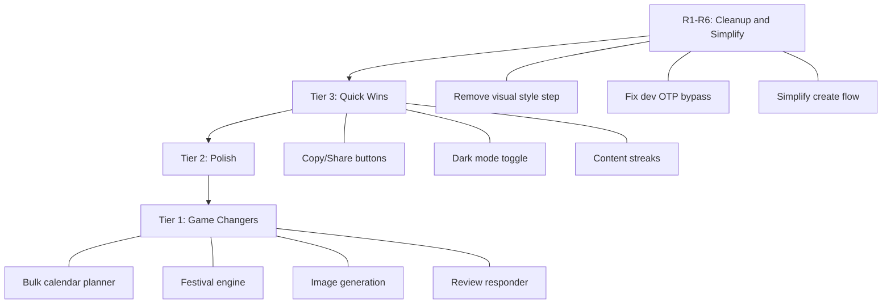

# BusinessPro -- Feature Suggestions to Make It Amazing

## What You Already Do Well

Before the suggestions, here's what's solid: the AI generation pipeline (ideas, captions, hooks, hashtags), the context/memory system that learns over time, smart presets per business type, the 7-step content creation flow, and the multi-platform targeting. These are strong foundations to build on.

---

## TIER 1: High Impact, Medium Effort (Game Changers)

### 1. AI Bulk Content Calendar ("Plan My Week / Month")

**Why:** A cafe owner doesn't want to create 1 post at a time. They want to tap one button and get a full week of varied content ready to go.

**What:** A "Plan My Week" button on the dashboard that:

- Generates 7 (or 30) diverse posts across platforms
- Mixes content goals (2 promotions, 2 engagement, 1 festival, 1 awareness, 1 offer)
- Spreads them across days with suggested posting times
- Auto-fills the calendar; user just reviews and approves

**Where it fits:**

- New endpoint `POST /ai/generate/weekly-plan` in [ai.controller.ts](api/src/ai/ai.controller.ts)
- New prompt in [ai-prompts.ts](api/src/ai/prompts/ai-prompts.ts)
- New page or modal accessible from dashboard and calendar

---

### 2. Festival/Event Content Engine

**Why:** India has 30+ major festivals per year. Diwali, Holi, Eid, Pongal, Navratri, Independence Day, local events -- these are prime content opportunities. No local business owner should have to remember them.

**What:**

- A curated database of Indian festivals/events with dates, relevant business types, and content themes
- "Upcoming Festivals" widget on the dashboard showing the next 3 festivals
- One-tap "Create Festival Post" that pre-fills the content goal, tone, and generates festive content with the right context
- Push notification / in-app reminder 3 days before a relevant festival

**Where it fits:**

- New `festivals` table with `name`, `date`, `relevantBusinessTypes[]`, `themes[]`, `region`
- New `FestivalsModule` in the API
- Widget in [dashboard/page.tsx](our-app/app/(dashboard)/dashboard/page.tsx)

---

### 3. AI Image/Creative Generation

**Why:** Right now the app generates text only. A local business owner still needs to open Canva or hire a designer. If you can generate the visual too, it's a complete solution.

**What:**

- After caption is generated, offer "Generate Image" using DALL-E 3 or Flux
- Pre-built style templates: product photo style, festive background, promotional banner, quote card
- Generated image previewed inside the phone mockup in `ContentPreview`

**Where it fits:**

- New method in `AIGatewayService` for image generation
- New `POST /ai/generate/image` endpoint
- Update [content-preview.tsx](our-app/components/create/content-preview.tsx) to show generated images

---

### 4. Google Review Response Generator

**Why:** Google Business is one of your 4 platforms. Local businesses live and die by Google reviews, but most owners struggle to respond professionally. This is a unique differentiator no competitor offers well.

**What:**

- New page: "Reviews" in the dashboard
- Paste a customer review, AI generates a professional, on-brand response
- Tone matching: thankful for positive, empathetic + solution-oriented for negative
- Uses the business context/memory system for personalized responses

**Where it fits:**

- New `POST /ai/generate/review-response` endpoint
- New page `our-app/app/(dashboard)/reviews/page.tsx`

---

### 5. WhatsApp Broadcast Content

**Why:** WhatsApp is THE channel for local businesses in India. Most cafes, salons, kirana stores communicate with customers via WhatsApp Status and broadcast lists.

**What:**

- When platform is "WhatsApp", generate content optimized for WhatsApp Status (short, punchy, with CTA)
- Generate WhatsApp-friendly message format (no markdown, emoji-rich, with offers/links)
- "Copy to WhatsApp" button that formats text for WhatsApp sharing

**Where it fits:**

- Update prompts in [ai-prompts.ts](api/src/ai/prompts/ai-prompts.ts) with WhatsApp-specific formatting
- Add "Copy" and "Share to WhatsApp" actions in `ContentPreview`

---

## TIER 2: Medium Impact, Low-Medium Effort (Polish & Delight)

### 6. AI Performance Insights (Not Just Numbers)

**Why:** The analytics page shows numbers, but a salon owner doesn't know what "engagement rate 3.2%" means. AI should tell them what to do.

**What:** Replace raw analytics with AI-narrated insights:

- "Your Tuesday posts get 2x more engagement than Friday -- try posting your offers on Tuesday"
- "Festive content outperforms promotional content by 40% -- lean into seasonal themes"
- "Your audience responds best to Hinglish captions"

**Where it fits:**

- New `POST /ai/generate/insights` endpoint that takes analytics data and returns natural-language advice
- Insights card at the top of [analytics/page.tsx](our-app/app/(dashboard)/analytics/page.tsx)

---

### 7. Content Templates Library

**Why:** Not every post needs to be AI-generated from scratch. Common scenarios should have ready-made templates.

**What:** A library of 20-30 templates organized by scenario:

- Grand Opening, New Menu Item, Festival Sale, Customer Testimonial, Behind the Scenes, Holiday Hours, Flash Sale, Hiring, Thank You Post, Milestone (100th customer), etc.
- Each template has pre-filled goal, tone, and a skeleton caption
- User taps template, it auto-fills the create flow, then AI enhances it

**Where it fits:**

- Seed data in `context_templates` table (already exists in the schema)
- New "Templates" tab on the create page
- Leverage existing [context-template.entity.ts](api/src/context/entities/context-template.entity.ts)

---

### 8. Regional Language Support

**Why:** You support English, Hindi, and Hinglish. But India has 22 official languages. A salon in Chennai wants Tamil, a boutique in Kolkata wants Bengali.

**What:** Add these high-demand languages to the `Language` enum:

- Tamil, Telugu, Marathi, Bengali, Gujarati, Kannada

**Where it fits:**

- Update [enums/index.ts](api/src/common/enums/index.ts) to add new language values
- Update prompts to handle regional languages
- Update [step-timeline.tsx](our-app/components/create/step-timeline.tsx) language options

---

### 9. "Trending Today" Content Suggestions

**Why:** Business owners don't know what's trending. Showing them trending topics/hashtags for their niche gives them easy content ideas.

**What:**

- A "Trending" section on the dashboard
- AI generates 3-5 trending topic suggestions based on business type, location, and current events/seasons
- One-tap to create content from a trend

**Where it fits:**

- Enhance existing `GET /ai/suggestions` endpoint (already exists but basic)
- New dashboard widget

---

### 10. Post Preview Per Platform

**Why:** `ContentPreview` shows a phone mockup, but an Instagram post looks different from a WhatsApp status or a Google Business update. The preview should match the actual platform.

**What:** Different preview layouts per platform:

- Instagram: square image + caption + hashtags below
- Facebook: link preview card style
- WhatsApp: status-style with text overlay
- Google Business: update card with CTA button

**Where it fits:**

- Update [content-preview.tsx](our-app/components/create/content-preview.tsx) with platform-specific layouts

---

## TIER 3: Quick Wins (Low Effort, Noticeable Impact)

### 11. "Copy Caption" and "Share" Buttons

**Why:** Until real platform APIs are integrated, users need to easily copy their generated content and paste it into Instagram/WhatsApp/Facebook manually.

**What:**

- "Copy Caption" button (copies text to clipboard)
- "Copy Hashtags" button (copies hashtags separately)
- "Share via WhatsApp" deep link
- "Download Image" (when image generation is added)

---

### 12. Content Streak / Gamification

**Why:** Consistency is the hardest part of social media. Gamify it.

**What:**

- "You've posted 5 days in a row!" streak counter on dashboard
- Weekly posting goal (e.g., "3 posts this week") with progress ring
- Badge system: "First Post", "7-Day Streak", "Festival Pro", "100 Posts"

---

### 13. Dark Mode Toggle in Settings

**Why:** `darkMode` exists in Zustand store but there's no UI toggle for it. Free win.

---

### 14. Keyboard Shortcuts

**Why:** Power users on desktop should be able to navigate fast.

**What:** `Ctrl+N` = New post, `Ctrl+K` = Command palette, `Ctrl+S` = Save draft

---

## THINGS TO REMOVE OR SIMPLIFY

### R1. Remove "Visual Style" Step from Create Flow

The options (clean, festive, modern, bold) don't affect anything since there's no image generation. It adds friction without value. **Remove it** until AI image generation is added, then bring it back as the image style selector.

### R2. Remove Hardcoded Development OTP `123456`

In [auth.service.ts](api/src/auth/auth.service.ts) line 162, the `isDevelopmentOtp` bypass allows anyone to reset any password with code `123456`. This must be removed or gated behind `NODE_ENV === 'development'` strictly.

### R3. Fix or Remove "Generate Now" in QuickActions

The "Generate Now" button in [quick-actions.tsx](our-app/components/create/quick-actions.tsx) is wired to `() => {}` (does nothing). Either connect it to the generation flow or remove it.

### R4. Align Subscription Plan Names

Frontend shows Free/Starter/Pro but backend has free/starter/professional/enterprise. Either add Enterprise to frontend pricing or remove it from backend to avoid confusion.

### R5. Remove Deprecated Platform Preferences

`UsersService.getPlatformPreferences()` and `updatePlatformPreferences()` are explicitly marked as deprecated no-ops. Remove the methods and their routes from [users.controller.ts](api/src/users/users.controller.ts).

### R6. Simplify the 7-Step Create Flow to 3 Steps

7 steps is a lot of taps for a busy business owner. Consolidate:

- **Step 1:** Platform + Goal (combined)
- **Step 2:** Preview + Edit (AI generates immediately, user tweaks)
- **Step 3:** Schedule or Post Now

Business type, tone, language, and visual style should come from user profile defaults (set once in settings, not every time).

---

## Recommended Priority Order

Start with the cleanups (R1-R6), then quick wins (Tier 3), then polish (Tier 2), then the game-changers (Tier 1). The cleanups and quick wins will make the current app feel tight and polished, while the Tier 1 features will differentiate BusinessPro from every other social media tool.